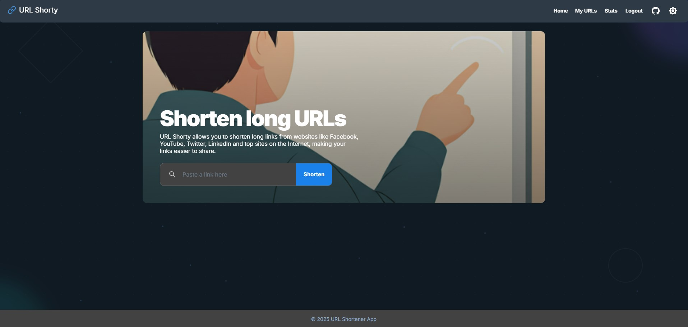

# URL Shorty - Full-Stack URL Shortener

URL Shorty is a comprehensive application designed to shorten long URLs into manageable, unique aliases. It features user authentication, URL management, click tracking via RabbitMQ and PostgreSQL, and a responsive React frontend. The entire application is containerized with Docker for easy setup, This project is deployed to [https://prm.co.il/](https://prm.co.il/) using Docker, Docker Compose, Traefik as a reverse proxy, and Let's Encrypt for SSL certificates.

---

## Table of Contents

- [Live Demo](#live-demo)
- [Architecture Overview](#architecture-overview)
- [Features](#features)
- [Tech Stack](#tech-stack)
- [Prerequisites](#prerequisites)
- [Getting Started (Docker Setup)](#getting-started-docker-setup)
- [Local Development (Without Docker for Services)](#local-development-without-docker-for-services)
- [API Endpoints](#api-endpoints)
- [API Docs (Swagger)](#api-docs-swagger)
- [Environment Variables](#environment-variables)
- [Scripts](#scripts)

---

## Live Demo

You can see a live demo of the project here: [https://prm.co.il/](https://prm.co.il/)

---

## Architecture Overview

The application follows a 3-service architecture, consisting of three core services that communicate asynchronously via a message broker (RabbitMQ).

1.  **Management Service (`apps/management-service`)**: The central API for all user-facing and data-management operations.

    - **Responsibilities**: Handles user registration and JWT-based authentication, validates and shortens new URLs, lists user-specific URLs, and provides access to click statistics.
    - **Data Storage**: Uses a **PostgreSQL** database (via TypeORM) as its primary data store for users and URL metadata.
    - **Communication**:
      - When a new URL is created, it publishes a message to a RabbitMQ queue (`url_created_queue`) so the Redirect Service can cache it.
      - It consumes messages from a separate RabbitMQ queue (`click_events_queue`) to asynchronously update click counts in PostgreSQL, preventing the redirection process from being blocked by database writes.

2.  **Redirection Service (`apps/redirect-service`)**: A highly-optimized, lightweight service dedicated solely to handling URL redirections.

    - **Responsibilities**: Receives incoming requests for short URLs (`/{shortId}`) and performs the lookup and redirection.
    - **Data Storage**: Uses an in-memory **Redis** cache to store a mapping of `shortId` to `originalUrl` for fast lookups.
    - **Communication**:
      - It consumes messages from the `url_created_queue` to keep its Redis cache up-to-date with the latest short URLs.
      - When a short URL is accessed, it publishes a message to the `click_events_queue` to notify the Management Service that a click occurred.

3.  **Client App (`apps/client-app`)**: A modern, responsive frontend built with React.
    - **Responsibilities**: Provides the entire user interface for registration, login, URL shortening, and viewing personal URL lists and statistics.
    - **Architecture**: Built with **React (Vite)**, **Redux Toolkit** for state management, **MUI** for UI components, and **Tailwind CSS** for styling. It communicates exclusively with the **Management Service** via its REST API.
    - **Business Logic**: Utilizes custom hooks (e.g., `useUrlShortener`, `useCopyToClipboard`) to abstract component logic and interactions with the Redux store, promoting code reuse and separation of concerns.

## Features

- User registration and JWT-based authentication.
- Shortening of long URLs to unique, 11-character IDs (using `nanoid`).
- Redirection from short URLs to original long URLs.
- Asynchronous click tracking for short URLs, persisted in PostgreSQL.
- Authenticated, user-specific click statistics: Only logged-in users can view stats for the short URLs they have created. Stats for other users’ URLs are not accessible.
- "My URLs" page for authenticated users to view their created links.
- "My Recent Anonymous Links" (max 5) stored in browser `localStorage` for non-authenticated users.
- Dark/Light mode with `localStorage` persistence.
- Responsive UI built with MUI and Tailwind CSS.
- Containerized with Docker for consistent environments.
- Deploy on OCI live at [https://prm.co.il/](https://prm.co.il/)
- Swagger documentation at [https://prm.co.il/api/api-docs/](https://prm.co.il/api/api-docs/)
- **API Rate Limiting:** To prevent abuse, the following rate limits are in place:
  - **Authentication:** 10 requests per 5 minutes per IP.
  - **URL Shortening:** 10 requests per minute per IP.
  - **URL Statistics:** 25 requests per minute per IP.
  - **Redirection:** 50 requests per minute per IP.
- **Secure Backend:**
  - **Input Validation:** All API endpoints validate incoming data to protect against common vulnerabilities.
  - **Centralized Error Handling:** A middleware is used for consistent error handling across the application.
  - **Structured Logging:** The application uses Winston for structured, environment-aware logging.
  - **Database Migrations:** Database schema changes are managed through TypeORM migrations.
- **Advanced Frontend:**
  - **Mobile-First Responsive Design:** The UI is optimized for both mobile and desktop devices.
  - **Centralized State Management:** Redux Toolkit is used to manage application state for authentication, UI, and URL data.
  - **Theming with Animated Background:** A customizable theming system with an animated background for a modern look and feel.

---

## Tech Stack

- **Monorepo:** Nx
- **Frontend (`client-app`):** React (with Vite), Redux Toolkit, MUI, Tailwind CSS, Axios, `react-router-dom`
- **Backend (`management-service`, `redirect-service`):** Node.js, Express, TypeScript
- **Database:** PostgreSQL (via TypeORM in `management-service`)
- **Cache:** Redis (for `redirect-service`)
- **Message Queue:** RabbitMQ
- **Containerization:** Docker, Docker Compose
- **Cloud:** Oracle Cloud Infrastructure
- **Unique ID Generation:** `nanoid`
- **Logging:** Winston
- **Traefik:** Reverse Proxy with Traefik
- **Let's Encrypt:** SSL certificate provider.

---

## Prerequisites

- Node.js (e.g., v22.x as used in Dockerfiles)
- npm (e.g., v10.x or v11.x)
- Docker & Docker Compose

---

## Screenshots

Here's a glimpse of the URL Shorty web application in action:

## 

## Getting Started (Docker Setup - Recommended)

This is the easiest way to get the entire application stack running with default development settings.

1.  **Clone the Repository:**

    ```bash
    git clone https://github.com/zixiz/url-shortener-nx.git
    cd url-shortener-nx
    ```

2.  **Install Workspace Dependencies:**
    (This step is primarily for local development tools like Nx CLI, but good to run once.)

    ```bash
    npm install
    ```

3.  **Configure Environment Variables:**
    This project uses `.env` files for service-specific configurations and a root `.env` file for Docker Compose overrides. Example files are provided.

    - **Root Configuration (Optional - for Docker Compose Overrides):**
      To override default host ports or default credentials for external services (PostgreSQL, RabbitMQ), create a `.env` file in the project root:

      ```bash
      cp .env.example .env
      ```

      Then, edit the new `url-shortener-nx/.env` file with your desired values. If you skip this step, Docker Compose will use the defaults specified within `docker-compose.yml`.

    - **Service-Specific Configurations (Required for `env_file` directive):**
      The `docker-compose.yml` is configured to look for `.env` files for each application service. You **must create these files**, but they can be initially empty to use the defaults provided in `docker-compose.yml`. For custom settings (like a different JWT secret for `management-service`), you would edit these files.

      Create the following files by copying their examples:

      ```bash
      cp apps/management-service/.env.example apps/management-service/.env
      cp apps/redirect-service/.env.example apps/redirect-service/.env
      ```

      And for the client application (for local Vite development, though Docker build uses ARGs):

      ```bash
      cp apps/client-app/.env.example apps/client-app/.env
      ```

      **Important for Backend Services in Docker:** The default values set in `docker-compose.yml`'s `environment` section for `management-service` and `redirect-service` are already configured to use Docker service names (e.g., `postgres_main`, `redis`, `rabbitmq`) for inter-container communication. You typically won't need to change `DATABASE_URL`, `REDIS_URL`, `RABBITMQ_URL` in `apps/management-service/.env` or `apps/redirect-service/.env` when running with Docker Compose unless you have a very specific custom setup. Leaving these files empty after copying will use the Docker-ready defaults from `docker-compose.yml`.

4.  **Build and Run Docker Containers:**
    From the workspace root:

    ```bash
    docker-compose up -d   # Start all services in detached mode
    ```

5.  **Access Services:**

    - **Client App (Frontend):** `http://localhost:4200` (or the `CLIENT_APP_HOST_PORT` you set in the root `.env`)
    - **Management Service API:** `http://localhost:3001` (or `MANAGEMENT_SERVICE_HOST_PORT`)
    - **Redirect Service:** `http://localhost:3003` (or `REDIRECT_SERVICE_HOST_PORT`)
    - **Redirect Service:** `http://localhost:3003` (or `REDIRECT_SERVICE_HOST_PORT`)
    - **RabbitMQ Management UI:** `http://localhost:15672` (user: `guest`, pass: `guest`)

    - **API Docs (Swagger):**
      - Management Service: `http://localhost:3001/api/api-docs/`
      - Redirect Service: `http://localhost:3003/redirect-api-docs/#/`

6.  **Stopping Services:**
    ```bash
    docker-compose down
    ```
    To also remove data volumes (PostgreSQL data, Redis data, RabbitMQ data):
    ```bash
    docker-compose down --volumes
    ```

---

## Local Development (Without Docker for Application Services)

If you prefer to run application services directly on your host machine (e.g., for faster iteration during development) while using Docker for external dependencies:

1.  Follow steps 1 & 2 from "Getting Started (Docker Setup)" to clone and install npm dependencies.
2.  **Start External Dependencies with Docker Compose:**
    ```bash
    docker-compose up -d postgres_main redis rabbitmq
    ```
3.  **Setup Service-Specific `.env` Files:**
    - Create/Update `apps/management-service/.env`: Ensure `DATABASE_URL`, `REDIS_URL`, `RABBITMQ_URL` point to `localhost` with the host ports defined in your root `.env` (e.g., `localhost:5432` for DB, `localhost:6379` for Redis, `localhost:5672` for RabbitMQ).
    - Create/Update `apps/redirect-service/.env`: Similar, point `REDIS_URL` and `RABBITMQ_URL` to `localhost` and respective host ports.
    - Create/Update `apps/client-app/.env` (for Vite): Set `VITE_MANAGEMENT_API_URL=http://localhost:3001/api` and `VITE_APP_BASE_URL=http://localhost:3003`.
4.  **Run Each Application Service:**
    Open separate terminals for each:
    ```bash
    npx nx serve management-service
    npx nx serve redirect-service
    npx nx serve client-app
    ```

---

## API Endpoints

(Refer to the "API Endpoints Overview" section from the previous README content you liked, ensuring paths match the `management-service` setup, e.g., `/api/auth/login`, `/api/urls`, `/api/stats/:shortId`).

---

## API Docs (Swagger)

Both backend services expose interactive Swagger documentation:

- Management Service Swagger UI: `http://localhost:3001/api/api-docs/`
- Redirect Service Swagger UI: `http://localhost:3003/redirect-api-docs/#/`

These UIs are available in development and Docker environments. They are generated from the OpenAPI definitions in each service (`apps/management-service/src/swagger.ts` and `apps/redirect-service/src/swagger.ts`).

---

## Environment Variables

- **Root `.env` (for `docker-compose.yml`):** See `.env.example`. Defines ports, default credentials for external services, and build arguments for `client-app`.
- **`apps/management-service/.env`**: See its `.env.example`. Configures database, Redis, RabbitMQ connections (using service names when run in Docker, localhost for local dev), JWT settings, etc.
- **`apps/redirect-service/.env`**: See its `.env.example`. Configures Redis, RabbitMQ connections.
- **`apps/client-app/.env` (used by Vite for `nx serve client-app`):**
  - `VITE_MANAGEMENT_API_URL`: Base URL for the management API.
  - `VITE_APP_BASE_URL`: Base URL for generated short links.

---

## Scripts (Root `package.json`)

- `npm run dev:management`: Serves the management service locally.
- `npm run dev:redirect`: Serves the redirect service locally.
- `npm run dev:client`: Serves the client-app (Vite React frontend) locally.
- `npm run build:management`: Builds the management service for production.
- `npm run build:redirect`: Builds the redirect service for production.
- `npm run build:client`: Builds the client-app for production.
- (Add other common Nx scripts like `lint`, `test` as you implement them)
